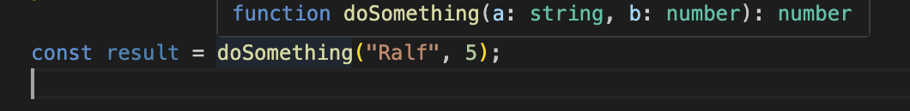
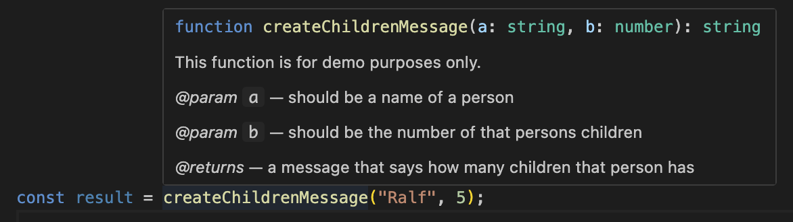

# Mentoring 17.01.2026

## Destructuring, Spread Operator, Rest Operator (continued from previous session)

### Rest operator

The rest operator (...) collects multiple values into a single array (or object) when destructuring or defining function parameters. It’s commonly used to handle an unknown number of arguments or to separate some elements from the “rest” in a concise, readable way.

 
🚨 The rest operator looks identical to the spread operator (`...`), it depends on the context, which one is applied:

```js
const person = {
  name: "Ralf",
  address: {
    city:"Bonn"
  }
  age: 57,
};
// Three dots indicate the rest operator if they appear
// a) on the left side of an assignment as part of a destructuring:

const {name, ...rest} = person; // rest will contain everything except name

// b) in a destructuring expression in the params section of a function

function doSomething({name, ...rest}){
    // The function expects to receive an object as first param.
    // name will be destructured out of that object, rest will be an object containing all other key/value pairs except name
}

// c) in the param list of a function

function doSomethingElse(param1, param2, ...rest){
    // This function expects a variable number of arguments
    // param1 and param2 will be directly accessible, all other parameters will be received in an array called rest
}

// If the three dots appear on the right side of an assignment, they indicate the spread operator instead!:

const extendedPerson = {
    ...person,
    hobbies: ["piano", "chess", "football"]
}

// This will create a NEW object (extendedPerson) with all key/value pairs from person PLUS a new key/value pair for hobbies.
```

## Documenting code

To document your code and make use of the tooltips VSCode provides if you hover over a function/variable, you can do 2 things:

### Use Typescript

VS Code will automatically use your type information to display it in the tooltips:
E.g. if you define a function like this somewhere:

```ts
export function doSomething(a: string, b: number): number {
  // do something
}
```

... then VS Code will automatically create a tooltip if you want to use the function somewhere else:



So VS Code will display the **signature** of your function:

- The function name
- Data types of its parameters
- Return type

In many cases this is already enough if you choose good function/variable names!

### Optional: Use [JSDocs](https://jsdoc.app/)

If you want to add additional documentation, you can use [JSDocs](https://jsdoc.app/) to create special comments that will be displayed in tooltips:

```ts
/**
 * This function is for demo purposes only.
 * @param  a should be a name of a person
 * @param  b should be the number of that persons children
 * @returns a message that says how many children that person has
 */
export function createChildrenMessage(a: string, b: number): string {
  return `${a} has ${b} children`;
}
```

This will generate a tooltip like this:



🚨 Be careful with additional comments! If your code evolves you have to adjust the comments manually to keep them in sync! If you forget this, they might become misleading, which is far worse than no/missing comments!

## Internationalization with i18n

i18n (internationalization) is the general concept of designing software so it can be easily adapted to different languages and regions (dates, numbers, texts, etc.) without changing the code.
i18next is a concrete library that implements i18n in practice by providing APIs for translations, language switching, namespaces, and interpolation in JavaScript applications.

In Vanilla JS applications you usually set up `i18next` like this:
(It will work slightly different in frameworks like React)

- Install i18next: `npm i i18next`
- Create translation files that look like this:

```js
// german.js
const germanTranslations = {
  translation: {
    homepage: {
      title: "Willkommen zu meiner Website",
      subtitle: "Hier kann man alles mögliche machen",
    },
  },
};
export default germanTranslations;
```

```js
// english.js
const englishTranslations = {
  translation: {
    homepage: {
      title: "Welcome to my website",
      subtitle: "You can do all kinds of things here",
    },
  },
};
export default englishTranslations;
```

- Initialize i18next with your language files:

```js
import i18next from "i18next";
import germanTranslations from "./i18n/german.js";
import englishTranslations from "./i18n/english.js";

i18next.init({
  lng: "en",
  debug: true,
  resources: {
    en: englishTranslations,
    de: germanTranslations,
  },
});
```

- Mark all of your HTML tags that need to be translated with a special `data-` attribute, e.g. `data-t` or `data-i18n` and provide the key of the corresponding translation:

```html
<main>
  <h1 data-t="homepage.title"></h1>
  <h2 data-t="homepage.subtitle"></h2>
</main>
```

- Create a function that iterates over all tags containing the `data-t` attribute and set the textContent:

```js
function translateAll() {
  const translationTargets = document.querySelectorAll("[data-t]");
  translationTargets.forEach((el) => {
    const key = el.getAttribute("data-t");
    if (key) {
      el.textContent = i18next.t(key);
    }
  });
}
```

- Call this function whenever the language changes and it will rerender with the appropriate content!

## Recap: Expressions, statements and operators

### Statements

A statement is a complete instruction that performs an action.
Example: `let x = 5;` or `if (x > 0) { console.log(x); }`

### Expressions

An expression is any piece of code that evaluates to a value.
Example: `5 + 3, x > 0` or `getUserName()`

### Operators

Operators are symbols that combine or manipulate values (operands) to form expressions.
Example: `+` (addition) in `5 + 3`, `===` (comparison), or `&&` (logical AND)

More examples: [`/recap/expressions-statements-operators.ts](./recap/expressions-statements-operators.ts)
