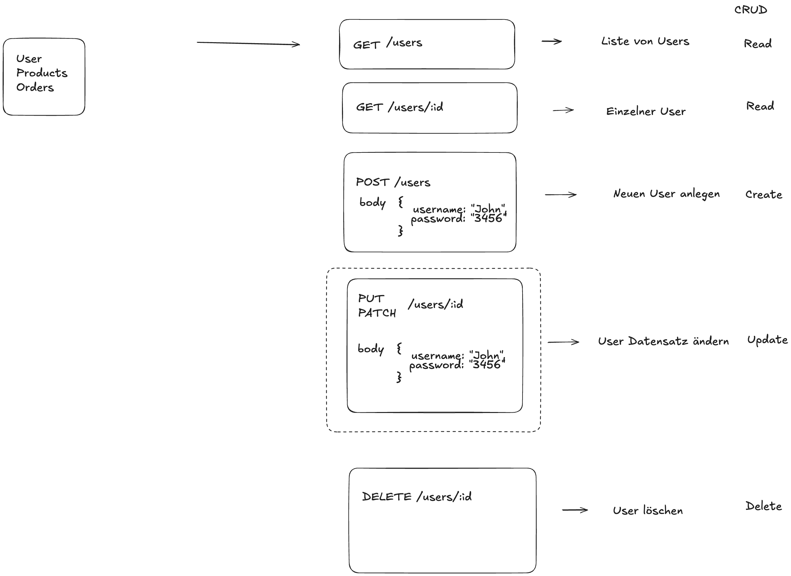

# Mentoring 30.01.2026

# Web APIs

Web APIs (Application Programming Interfaces) let different software systems communicate over the web in a standardized way. Their purpose is to expose data or functionality (for example from a server or third-party service) so other applications can use it without knowing the internal implementation. We need them to decouple systems, enable reuse, and allow web, mobile, or backend apps to talk to each other reliably. They typically work by a client sending an HTTP request (e.g. GET or POST) to a defined endpoint, and the server responding with structured data—usually JSON—along with a status code indicating success or failure.

## REST

REST is an architectural style for building Web APIs around resources like users or orders. It uses standard HTTP methods (GET, POST, PATCH, PUT, DELETE) to define actions, making APIs predictable and easy to use.

## The Express framework

Express is a minimal web framework for Node.js used to build Web APIs and web servers. It simplifies handling HTTP requests, routing, and middleware, so developers can focus on application logic instead of low-level details. Express works by mapping incoming requests to route handlers that generate and send responses.

[Demo Express App: Stories API](https://github.com/dci-fbw-wd-25-d04/mentoring-stories-api)
