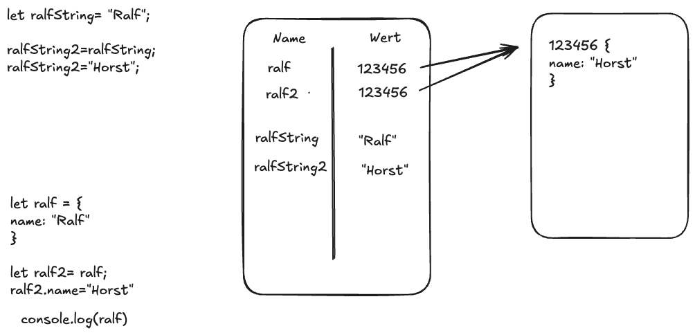

# Mentoring WD-25-04

## Mentoring 09.01.2026

### Recursive functions

A recursive function is a function that calls itself to solve a problem step by step.
Each recursive function must have a base case, which stops the recursion.
It also has a recursive case, where the function calls itself with a smaller or simpler input.
Recursion is often used for problems that can be broken into similar subproblems, such as traversing trees or calculating factorials.

- [Demo: Building a parent-path for a given node in a tree (function createPathRecursive)](./recursion/pathfinder.js)
- [Demo: Navigating "top-down" through a tree structure (function printElementWithChildrenRecursive)](./recursion/pathfinder.js)

### Reference types

Reference types are data types where variables store a reference (address) to the actual value, not the value itself.
In JavaScript, objects, arrays, and functions are reference types.
When you assign or pass them to another variable, both variables point to the same data.
Changing the data through one reference affects all references to it.

### Destructuring, Spread Operator, Rest Operator (to be continued...)

#### Destructuring

Destructuring is a JavaScript feature that lets you extract values from arrays or objects into variables in a concise way.
Instead of accessing values one by one, you can unpack multiple values in a single statement.
It improves readability and reduces repetitive code.
Destructuring works for both arrays (by position) and objects (by property name).

[Demo: Destructuring](./destructuring/index.ts)

#### Spread Operator

The spread operator (`...`) is used to expand elements of an array or properties of an object into a new array or object.
It is commonly used to copy, merge, or add values without modifying the original data.
This helps keep code clean and immutable.
The spread operator works with arrays, objects, and function arguments.

[Demo: Spread operator](./destructuring/index.ts)

#### Rest operator

coming soon...
